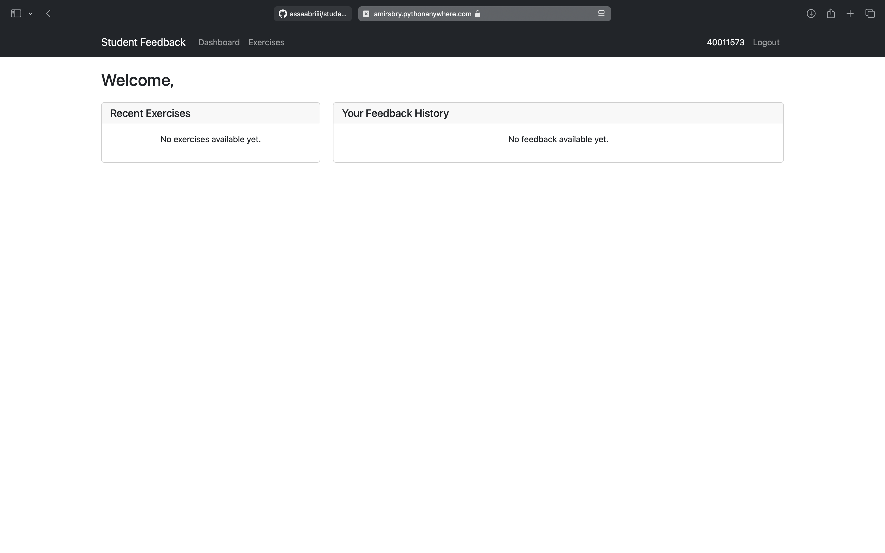

# Feedback Platform

A web-based feedback platform built with Django.
I've made this project for managing my class



## Description

This project is a feedback management system that allows users to submit, manage, and analyze feedback. Built using Django framework, it provides a robust and scalable solution for handling user feedback.

## Prerequisites

- Python 3.8 or higher
- Django 4.x
- pip (Python package manager)

## Installation

1. Clone the repository:

```bash
git clone "https://github.com/assaabriiii/student_panel.git"
```


2. Create a virtual environment:

```bash
python -m venv venv
```


3. Activate the virtual environment:

```bash
venv\Scripts\activate # activate the virtual environment on windows
source venv/bin/activate # activate the virtual environment on macOS and linux
```


4. Install dependencies:

```bash
pip install -r requirements.txt
```


5. Apply database migrations:

```bash
python manage.py migrate
```


6. Create a superuser (admin):

```bash
python manage.py createsuperuser
```


## Running the Development Server

Start the development server:

```bash
python manage.py runserver
```

The application will be available at `http://localhost:8000` and live on `http://amirsbry.pythonanywhere.com`


## Contributing

1. Fork the repository
2. Create a new branch
3. Make your changes
4. Submit a pull request


## License

This project is licensed under the [Apache License](https://github.com/assaabriiii/student_panel/blob/main/LICENSE).

## Contact

For any questions or concerns, please open an issue in the repository.